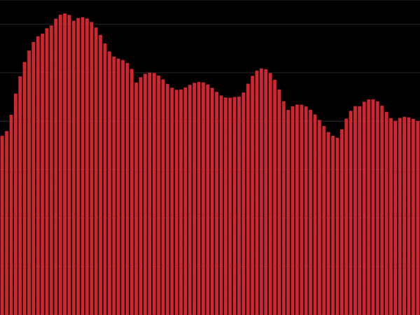
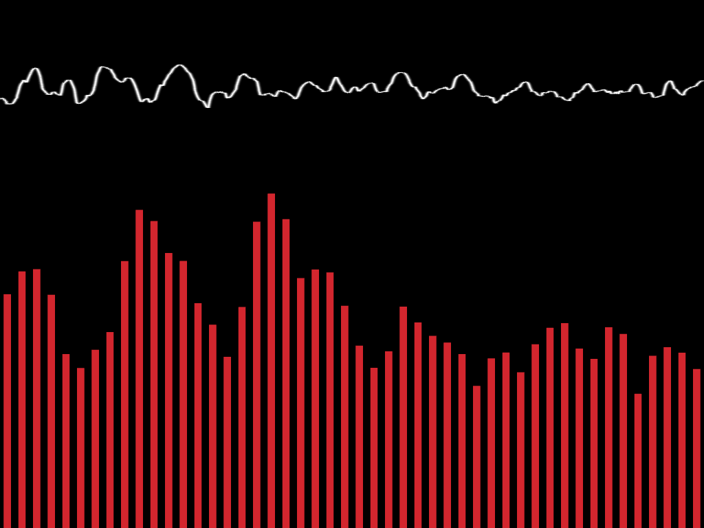

# Examples
## Default Configuration

* high resolution FFT
* minimal bar gap
* dB lines

## Minimal Configuration

File: `config-minimal`
* low resolution FFT
* medium bar gap
* no dB lines

## Oscilloscope Configuration

File: `config-osc`
* smooth lines

## Oscilloscope + Minimal Spectrum

File: `config-hybrid`
